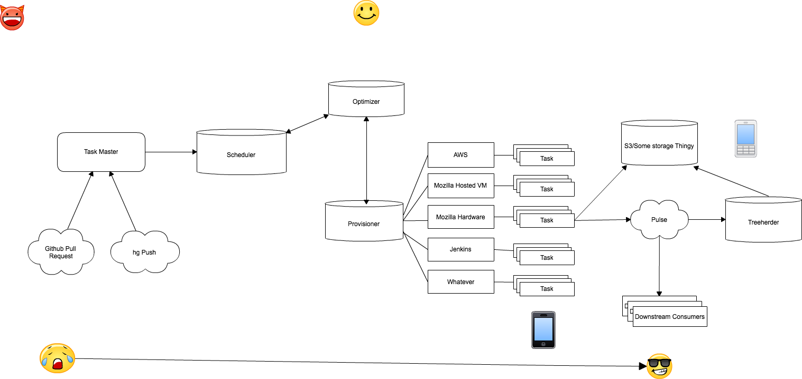

# Infra-X-Design (we are working on the name :p)

WARNING: The below is an etherpad copy/paste for now. The intent is the README.md will be a very high level overview and 
each component will have its own .md file with a detailed description.



[Source for image](https://cacoo.com/diagrams/UVEoW1R0nyYd7k37/edit)

# Terminology

  * Job - Has a 1-1 relationship with a commit / pull request
  * Task - Type of Container and what is run on the container
  * Container Provider - API to manage containers
  * Task Request -  A list of tasks and treeherder "job GUID"
  * Task Partition - task with a restricted set of files
  * Execution Plan - group of task 
  * Container - Test environment (i.e. AWS, TravisCI, Mozilla Virtual Machine, or Mozilla physical hardware); managed by the Provisioner
  * Commit - Could be a pull request or hg push, in treeherder this corresponds to a result set

## Treeherder object mapping
  * Job -> revision hash
  * Job group (string) -> Task
  * Job GUID -> Task Partition

# Components

## Job Master

#### Role: Generates *jobs* and provides corresponding *Task Requests* to the Scheduler

Initiation begins with a GitHub pull request or hg push
Independent piece of the system which deals with per-project buisness logic. Initates *jobs* via talking to the scheduler.  Different projects will implement their own task masters; there won't be a generic component that can be used by everyone.
The task master receives result notifications via pusle for each task that is initiated as the result of a job, and is the component that can be queried to determine the overall status of the job.
Communicates the status of a given Job (result set) to treeherder.
Shepherd version:  initiate job with treeherder via pulse, initiate job with scheduler via rest.  Implements rest service and/or pulse notification for job status.

## Optimizer
#### Role:

## Scheduler

#### Role: Central dispatching piece.

  - Receive API request for a collection of tasks
  - Given a particular set of *tasks requests* determine the types of *containers* to pass to the optimizer which returns an execution plan
  - Give plan to provisioner
  - Listen to status of *task-partition* and update the overall status of the *task* (pulse)
  - Task Subdivisions map to "Job" groups in treeherder
  - Maintains a queue of tasks that the provisioner can't service immediately

## Provisioner (Machine Poofer)

```js
// Example object which would be sent to the provisioner
var Task =  {
    name: "...",
    files: [...],
    containerTag: ["linux_x86_64"],
    bootstrapper: ["http://..."],
    bootstrapperArguments: ["--revision=asdfasdf", ...]
}
```

#### Role: An interface to the *container providers*
- Prioritization of container providers
- Instantiation of containers (e.g., vm's) and related rules
- Monitor container status/health (i.e. mozpool?)


#### REST interface to:
 - types of containers
 - queue a task partition via an accept or reject response
 
## Executioner
#### Role: Inteface directly with machines via ip/port. Reports logs.

  - is given the container ip + port number
  - connect to the agent
    1. pass the task to the agent
    2. reads output / status from socket / write to log file
    3. notifiy pulse with status and log file
    4. notify provisioner completion of task-partition

## Container + Agent
#### Role: Agent reads task and builds a executable/script and passes output/status to the executioner
